# Avionics

> **High-Assurance Airline Reservation System** demonstrating "Robust TypeScript" with [Effect](https://effect.website/).

## Overview

Avionics simulates the critical lifecycle of a commercial airline reservation system, focusing on reliability and correctness in a high-concurrency environment.

### Core Concepts

- **Inventory Management**: Real-time seat availability with strict consistency (Zero Overbooking).
- **Complex Booking Lifecycle**: PassengerNameRecord (PNR) orchestration (Hold → Payment → Ticketing).
- **Resiliency**: Recovery from distributed failures using Sagas.
- **Zero-Throw Policy**: All business and technical errors are typed values (`Effect<A, E, R>`).

## Architecture

The project follows **Hexagonal Architecture** (Ports & Adapters) to decouple business logic from infrastructure.

### Domain Entities Diagram

```mermaid
classDiagram
    namespace Supply {
        class Flight {
            +FlightNumber flightNumber
            +Schedule schedule
            +Route route
        }

        class FlightInventory {
            +Buckets buckets
            +int version
        }
    }

    namespace Demand {
        class Booking {
            +PnrCode pnrCode
            +BookingStatus status
            +Date expiresAt
        }

        class BookingSegment {
            +Money price
            +CabinClass class
        }

        class Passenger {
            +String firstName
            +String lastName
            +Email email
        }
    }

    namespace Contract {
        class Ticket {
            +TicketNumber ticketNumber
            +TicketStatus status
            +PnrCode pnrCode
            +String passengerName
            +Coupon[] coupons
            +Date issuedAt
        }
    }

    %% Relationships
    FlightInventory --> Flight : Belongs To
    Booking ..> FlightInventory : Holds Seat
    Booking --> Ticket : Issues

    Booking *-- BookingSegment : Composition
    Booking *-- Passenger : Composition

    Ticket ..> Booking : References

    %% Styling
    style Flight fill:#4f4f4f,stroke:#fff
    style FlightInventory fill:#4f4f4f,stroke:#fff
    style Booking fill:#0ea5e9,stroke:#fff,color:#fff
    style BookingSegment fill:#0ea5e9,stroke:#fff,color:#fff
    style Passenger fill:#0ea5e9,stroke:#fff,color:#fff
    style Ticket fill:#10b981,stroke:#fff,color:#fff
```



### Workspace Structure

- **`packages/domain`**: The Core. Pure business logic, Entities, and Value Objects. **Dependencies**: `effect` and `@faker-js/faker` only.
- **`packages/application`**: The Orchestrator. Use Cases, Ports (Repository Interfaces), and Sagas.
- **`packages/infrastructure`**: The Adapters. Database implementation (Postgres), External APIs (Polar, Resend).
- **`apps/web`**: The Interface. Vite application consuming the core via adapters.

## Tech Stack

- **Runtime**: Node.js >=24
- **Monorepo**: Turborepo + pnpm (Strict Mode)
- **Framework**: Effect 3.x (Schema, Concurrency, Error Handling)
- **Testing**: Vitest + Faker
- **Linting**: Biome.js

## Quick Start

1.  **Install Dependencies**

    ```sh
    pnpm install
    ```

2.  **Start Development**

    ```sh
    pnpm dev
    ```

3.  **Run Tests**
    ```sh
    pnpm test
    # or
    pnpm test -F <packageName or appName>
    ```

## Development Commands

| Command              | Description                                      |
| :------------------- | :----------------------------------------------- |
| `pnpm build`         | Build all apps and packages                      |
| `pnpm test:coverage` | Run tests with V8 coverage reports               |
| `pnpm check`         | Run Biome lint and format checks                 |
| `pnpm clean`         | Clean generic `node_modules` and build artifacts |
| `pnpm typecheck`     | Run TypeScript type checking                     |

---

Maintained by **Bakate**.
