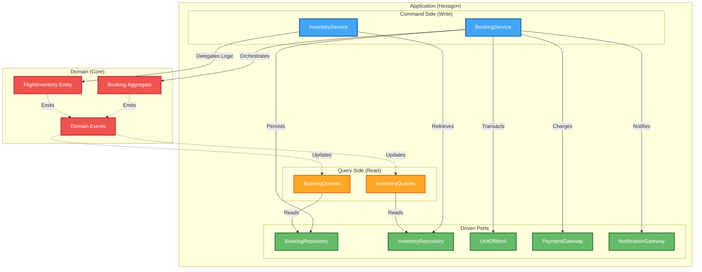
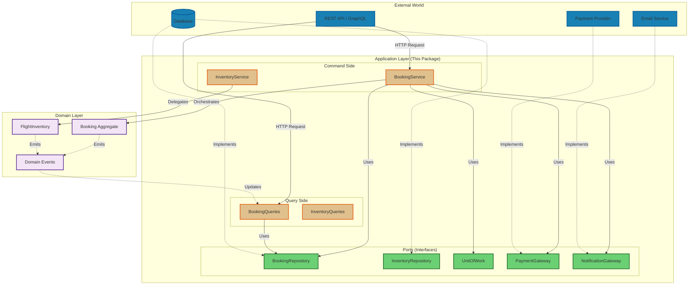

# Application Layer (Orchestration & Ports)

> **Purpose**: This package implements the Application Core in Hexagonal Architecture, orchestrating business workflows while remaining independent of infrastructure concerns.

## Table of Contents

- [What is the Application Layer?](#what-is-the-application-layer)
- [Architecture Overview](#architecture-overview)
- [Key Design Patterns](#key-design-patterns)
- [Directory Structure](#directory-structure)
- [Core Concepts](#core-concepts)
- [Usage Examples](#usage-examples)
- [Design Decisions & Trade-offs](#design-decisions--trade-offs)

## What is the Application Layer?

In **Hexagonal Architecture** (Ports & Adapters), this package serves as the **Hexagon** - the Application Core. It sits between the Domain (pure business logic) and Infrastructure (databases, APIs, external services).

### Responsibilities

1. **Orchestration**: Coordinate workflows across multiple domain entities
2. **Port Definitions**: Define interfaces (contracts) for infrastructure adapters
3. **Use Case Implementation**: Implement application-specific business flows
4. **Transaction Management**: Define transactional boundaries
5. **Error Handling**: Translate domain errors into application-level responses

### What It Does NOT Do

- ❌ Contain complex business rules (belongs in Domain)
- ❌ Know about databases, HTTP, or infrastructure details
- ❌ Depend on concrete implementations (only interfaces)

## Architecture Overview



### Dependency Flow



**Key Insight**: Notice how dependencies point **inward**. The Application Layer defines what it needs (ports), and Infrastructure adapts to those interfaces. This is **Dependency Inversion** in action.

## Key Design Patterns

### 1. Hexagonal Architecture (Ports & Adapters)

**Why**: Decouple business logic from infrastructure concerns, making the system testable and adaptable.

**How it works**:

- **Ports**: Interfaces defined by the application (e.g., `BookingRepository`, `PaymentGateway`)
- **Adapters**: Infrastructure implementations (e.g., PostgreSQL adapter, Stripe adapter)
- **Hexagon**: Application core that only depends on ports, never adapters

**Benefits**:

- ✅ Test business logic without databases or external services
- ✅ Swap infrastructure (e.g., PostgreSQL → MongoDB) without changing business code
- ✅ Delay infrastructure decisions until you understand requirements
- ✅ Multiple adapters for same port (e.g., in-memory for tests, PostgreSQL for production)

**Trade-offs**:

- ⚠️ More interfaces and indirection
- ⚠️ Requires discipline to maintain boundaries

### 2. CQRS (Command Query Responsibility Segregation)

**Why**: Separate read and write concerns for better scalability and simpler code.

**How it works**:

- **Command Side**: Services that modify state (BookingService, InventoryService)
- **Query Side**: Services optimized for reads (BookingQueries, InventoryQueries)
- **Read Models**: Denormalized views optimized for specific queries

**Benefits**:

- ✅ Scale reads and writes independently
- ✅ Optimize read models for specific UI needs (no complex joins)
- ✅ Simpler command logic (no need to return complex projections)
- ✅ Better performance (read replicas, caching, materialized views)

**Trade-offs**:

- ⚠️ Eventual consistency between write and read models
- ⚠️ More code (separate models for reads and writes)
- ⚠️ Complexity in keeping read models synchronized

**When to use**:

- ✅ High read-to-write ratio (most applications)
- ✅ Complex queries that don't map to domain model
- ✅ Need to scale reads independently
- ❌ Simple CRUD applications (overkill)

### 3. Domain Events

**Why**: Enable loose coupling, audit trails, and event-driven architectures.

**How it works**:

1. Domain entities emit events on state changes (e.g., `BookingConfirmed`)
2. Events are collected in aggregate's `domainEvents` array
3. After persistence, events are published to event bus
4. Event handlers update read models, send notifications, etc.

**Benefits**:

- ✅ Audit trail of all state changes
- ✅ Loose coupling (handlers don't know about each other)
- ✅ Enable event sourcing if needed
- ✅ Temporal queries ("what was the state at time X?")

**Trade-offs**:

- ⚠️ Eventual consistency
- ⚠️ Debugging distributed flows is harder
- ⚠️ Need infrastructure for event bus

### 4. Unit of Work Pattern

**Why**: Ensure atomic operations across multiple aggregates and maintain consistency.

**How it works**:

```typescript
// All operations succeed or all fail
yield *
  unitOfWork.transaction(
    Effect.all([
      bookingRepo.save(booking),
      inventoryRepo.save(inventory),
      eventBus.publish(events),
    ]),
  );
```

**Benefits**:

- ✅ ACID guarantees across multiple operations
- ✅ Automatic rollback on failure
- ✅ Transactional outbox pattern for events

**Trade-offs**:

- ⚠️ Requires database transaction support
- ⚠️ Can't span multiple databases easily
- ⚠️ Long transactions can cause contention

### 5. Saga Pattern (Compensation)

**Why**: Handle distributed transactions and failures gracefully.

**How it works**:

```typescript
// Try payment
yield* paymentGateway.charge(amount, token).pipe(
  Effect.catchAll((error) =>
    Effect.gen(function* () {
      // Compensate: Release seats
      yield* inventoryService.releaseSeats(...);
      // Compensate: Cancel booking
      yield* booking.cancel("Payment failed");
      return yield* Effect.fail(error);
    })
  )
);
```

**Benefits**:

- ✅ Graceful failure handling
- ✅ Automatic compensation (undo operations)
- ✅ Works across service boundaries

**Trade-offs**:

- ⚠️ Eventual consistency
- ⚠️ Compensation logic must be idempotent
- ⚠️ Complex to reason about

### 6. Effect-Based Dependency Injection

**Why**: Type-safe, testable dependency injection without runtime magic.

**How it works**:

```typescript
export class BookingService extends Effect.Service<BookingService>()(
  "BookingService",
  {
    effect: Effect.gen(function* () {
      // Dependencies injected via Effect context
      const bookingRepo = yield* BookingRepository;
      const paymentGateway = yield* PaymentGateway;

      return {
        /* service methods */
      };
    }),
  },
) {}
```

**Benefits**:

- ✅ Compile-time type safety
- ✅ No decorators or reflection
- ✅ Easy to test (provide mock implementations)
- ✅ Explicit dependency graph

**Trade-offs**:

- ⚠️ Learning curve for Effect
- ⚠️ Different from traditional DI containers

## Directory Structure

```
src/
├── services/              # Command Side (Write Operations)
│   ├── booking.service.ts      # Booking use cases
│   └── inventory.service.ts    # Inventory management
│
├── queries/               # Query Side (Read Operations)
│   ├── booking-queries.ts      # Booking read models
│   ├── inventory-queries.ts    # Inventory read models
│   └── README.md               # CQRS documentation
│
├── repositories/          # Repository Ports (Data Access)
│   ├── booking.repository.ts   # Booking persistence interface
│   └── inventory.repository.ts # Inventory persistence interface
│
├── gateways/              # External Service Ports
│   ├── payment.gateway.ts      # Payment provider interface
│   └── notification.gateway.ts # Email/SMS interface
│
├── ports/                 # Infrastructure Ports
│   └── unit-of-work.ts         # Transaction management
│
└── models/                # DTOs and Read Models
    ├── results.ts              # Command results (write side)
    └── read-models.ts          # Query results (read side)
```

### File Organization Principles

1. **Services**: One service per aggregate or bounded context
2. **Queries**: Separate query service for each aggregate
3. **Repositories**: One repository interface per aggregate root
4. **Gateways**: One gateway per external system
5. **Models**: Separate read models from write models

## Core Concepts

### Services (Command Side)

Services orchestrate use cases by coordinating domain entities and infrastructure.

**Example: BookingService**

```typescript
export class BookingService extends Effect.Service<BookingService>()("BookingService", {
  effect: Effect.gen(function* () {
    // Inject dependencies
    const inventoryService = yield* InventoryService;
    const bookingRepo = yield* BookingRepository;
    const paymentGateway = yield* PaymentGateway;
    const unitOfWork = yield* UnitOfWork;

    return {
      bookFlight: (command: BookFlightCommand) =>
        Effect.gen(function* () {
          // 1. Hold seats (calls domain logic)
          const holdResult = yield* inventoryService.holdSeats({
            flightId: command.flightId,
            cabin: command.cabinClass,
            numberOfSeats: 1,
          });

          // 2. Create booking (domain factory method)
          const booking = Booking.create({
            id: generateId(),
            pnrCode: yield* generateUniquePnr(bookingRepo),
            passengers: [createPassenger(command.passenger)],
            segments: [createSegment(command, holdResult.totalPrice)],
            expiresAt: O.some(new Date(Date.now() + 30 * 60 * 1000)),
          });

          // 3. Save within transaction
          yield* unitOfWork.transaction(bookingRepo.save(booking));

          // 4. Process payment with retry and compensation
          yield* paymentGateway
            .charge(holdResult.totalPrice, command.creditCardToken)
            .pipe(
              Effect.retry(retryPolicy),
              Effect.timeout(Duration.seconds(30)),
              Effect.catchAll((error) =>
                Effect.gen(function* () {
                  // Compensate: Release seats
                  yield* inventoryService.releaseSeats({...});
                  // Compensate: Cancel booking
                  const cancelled = yield* booking.cancel("Payment failed");
                  yield* unitOfWork.transaction(bookingRepo.save(cancelled));
                  return yield* Effect.fail(error);
                })
              )
            );

          // 5. Confirm booking (domain method)
          const confirmed = yield* booking.confirm();
          yield* unitOfWork.transaction(bookingRepo.save(confirmed));

          return confirmed;
        }),
    };
  }),
}) {}
```

**Key Points**:

- ✅ Orchestration only - business logic in domain entities
- ✅ Explicit error handling with typed errors
- ✅ Compensation logic for distributed transactions
- ✅ Retry policies for resilience

### Repositories (Driven Ports)

Repositories define the contract for persisting and retrieving aggregates.

**Example: BookingRepository**

```typescript
export interface BookingRepositoryPort {
  // Returns saved entity (with version for optimistic locking)
  save: (
    booking: Booking,
  ) => Effect.Effect<Booking, BookingPersistenceError | OptimisticLockingError>;

  // Query methods
  findByPnr: (pnr: PnrCode) => Effect.Effect<Booking, BookingNotFoundError>;
  findById: (id: BookingId) => Effect.Effect<Booking, BookingNotFoundError>;
  findExpired: () => Effect.Effect<Booking[]>;
  findByPassengerId: (id: PassengerId) => Effect.Effect<Booking[]>;
}

export class BookingRepository extends Context.Tag("BookingRepository")<
  BookingRepository,
  BookingRepositoryPort
>() {}
```

**Design Decisions**:

1. **Return saved entity**: Enables optimistic locking (version incremented by DB)
2. **Typed errors**: Each method declares possible failures
3. **Effect-based**: Lazy evaluation, composable, testable
4. **Aggregate-focused**: Only query by aggregate root ID or unique keys

### Gateways (External Services)

Gateways define contracts for external systems.

**Example: PaymentGateway**

```typescript
export class PaymentGateway extends Context.Tag("PaymentGateway")<
  PaymentGateway,
  {
    readonly charge: (
      amount: Money,
      token: string,
    ) => Effect.Effect<void, PaymentError>;
  }
>() {}
```

**Why separate from repositories?**

- Repositories manage domain entities
- Gateways interact with external systems
- Different concerns, different interfaces

### Query Services (Read Side)

Query services provide optimized read models.

**Example: BookingQueries**

```typescript
export interface BookingQueriesPort {
  // Lightweight summary for lists
  getSummaryByPnr: (
    pnr: PnrCode,
  ) => Effect.Effect<BookingSummary, BookingNotFoundError>;

  // Paginated list with filters
  listBookings: (params: {
    page: number;
    pageSize: number;
    status?: PnrStatus;
  }) => Effect.Effect<PaginatedResult<BookingSummary>>;

  // Passenger history
  getPassengerHistory: (
    passengerId: PassengerId,
  ) => Effect.Effect<PassengerBookingHistory[]>;
}
```

**Read Model Example**:

```typescript
export class BookingSummary extends Schema.Class<BookingSummary>(
  "BookingSummary",
)({
  id: Schema.String,
  pnrCode: Schema.String,
  status: Schema.String,
  passengerCount: Schema.Number,
  totalPrice: Money,
  createdAt: Schema.Date,
  expiresAt: Schema.Option(Schema.Date),
}) {}
```

**Benefits**:

- Denormalized for fast queries
- No navigation through aggregate relationships
- Optimized for specific UI needs
- Can be cached aggressively

## Usage Examples

### Example 1: Booking a Flight (Happy Path)

```typescript
import {
  BookingService,
  BookFlightCommand,
} from "@workspace/application/booking.service";
import { Effect, Layer } from "effect";

// Define command
const command = new BookFlightCommand({
  flightId: "FL123",
  cabinClass: "Economy",
  passenger: {
    id: "PAX001",
    firstName: "Donald",
    lastName: "Doe",
    email: "donald@example.com",
    dateOfBirth: new Date("2000-01-01"),
    gender: "Male",
    type: "Adult",
  },
  seatNumber: O.some("12A"),
  creditCardToken: "tok_visa_4242",
});

// Execute use case
const program = Effect.gen(function* () {
  const service = yield* BookingService;
  const booking = yield* service.bookFlight(command);

  console.log(`Booking confirmed: ${booking.pnrCode}`);
  return booking;
});

// Run with dependencies
const runnable = program.pipe(
  Effect.provide(BookingServiceLive),
  Effect.provide(InventoryServiceLive),
  Effect.provide(BookingRepositoryLive),
  Effect.provide(PaymentGatewayLive),
  Effect.provide(NotificationGatewayLive),
  Effect.provide(UnitOfWorkLive),
);

Effect.runPromise(runnable);
```

### Example 2: Handling Payment Failure (Saga Pattern)

```typescript
// Payment fails → Automatic compensation
const program = Effect.gen(function* () {
  const service = yield* BookingService;

  const result = yield* service.bookFlight(command).pipe(
    Effect.catchTag("PaymentError", (error) =>
      Effect.gen(function* () {
        // Compensation already happened in service
        // Log and return user-friendly error
        yield* Effect.logError("Payment failed", error);
        return yield* Effect.fail({
          _tag: "UserError",
          message: "Payment declined. Please try another card.",
        });
      }),
    ),
  );

  return result;
});
```

### Example 3: Querying Bookings (CQRS)

```typescript
import { BookingQueries } from "@workspace/application/booking-queries";

const program = Effect.gen(function* () {
  // Dependencies
  const queries = yield* BookingQueries;

  // Get paginated list
  const result = yield* queries.listBookings({
    page: 1,
    pageSize: 20,
    status: "CONFIRMED",
  });

  console.log(`Found ${result.total} bookings`);

  // Get specific booking summary
  const summary = yield* queries.getSummaryByPnr("ABC123");
  console.log(`Booking ${summary.pnrCode}: ${summary.status}`);

  return result.items;
});
```

### Example 4: Testing with Mock Dependencies

```typescript
import { describe, it, expect } from "vitest";
import { Effect, Layer } from "effect";

describe("BookingService", () => {
  it("should book flight successfully", () => {
    // Mock dependencies
    const MockInventoryService = Layer.succeed(InventoryService, {
      holdSeats: () => Effect.succeed(new HoldSeatsResult({...})),
      releaseSeats: () => Effect.succeed(new ReleaseSeatsResult({...})),
      getAvailability: () => Effect.succeed(mockInventory),
    });

    const MockPaymentGateway = Layer.succeed(PaymentGateway, {
      charge: () => Effect.succeed(void 0),
    });

    const MockBookingRepo = Layer.succeed(BookingRepository, {
      save: (booking) => Effect.succeed(booking),
      findByPnr: () => Effect.fail(new BookingNotFoundError({...})),
      // ... other methods
    });

    // Run test
    const program = Effect.gen(function* () {
      const service = yield* BookingService;
      const booking = yield* service.bookFlight(command);
      expect(booking.status).toBe("CONFIRMED");
    });

    const testLayer = Layer.mergeAll(
      MockInventoryService,
      MockPaymentGateway,
      MockBookingRepo,
      // ... other mocks
    );

    Effect.runPromise(program.pipe(Effect.provide(testLayer)));
  });
});
```

## Design Decisions & Trade-offs

### Why Effect instead of Promises?

**Decision**: Use Effect for all async operations

**Rationale**:

- ✅ Typed errors (no try-catch, errors in type signature)
- ✅ Lazy evaluation (build program, run later)
- ✅ Composable (retry, timeout, fallback)
- ✅ Dependency injection built-in
- ✅ Resource safety (automatic cleanup)

**Trade-offs**:

- ⚠️ Learning curve
- ⚠️ Different from standard JavaScript patterns
- ⚠️ Requires Effect runtime

### Why separate Command and Query models?

**Decision**: CQRS with separate read/write models

**Rationale**:

- ✅ Optimize reads independently (denormalize, cache)
- ✅ Simpler write logic (no complex projections)
- ✅ Scale reads and writes independently
- ✅ Better performance

**Trade-offs**:

- ⚠️ Eventual consistency
- ⚠️ More code (duplicate models)
- ⚠️ Synchronization complexity

**When to use**:

- ✅ High read-to-write ratio (most apps)
- ✅ Complex queries
- ❌ Simple CRUD (overkill)

### Why Repository pattern instead of ORM?

**Decision**: Repository interfaces, not direct ORM usage

**Rationale**:

- ✅ Testable (mock repositories easily)
- ✅ Aggregate-focused (enforce boundaries)
- ✅ Swap implementations (PostgreSQL → MongoDB)
- ✅ Hide infrastructure details

**Trade-offs**:

- ⚠️ More boilerplate
- ⚠️ Can't use ORM features directly

### Why Domain Events?

**Decision**: Emit events on all state changes

**Rationale**:

- ✅ Audit trail
- ✅ Loose coupling
- ✅ Enable event sourcing
- ✅ Update read models

**Trade-offs**:

- ⚠️ Eventual consistency
- ⚠️ Debugging complexity
- ⚠️ Need event infrastructure

### Why Unit of Work?

**Decision**: Explicit transaction boundaries

**Rationale**:

- ✅ ACID guarantees
- ✅ Automatic rollback
- ✅ Transactional outbox for events

**Trade-offs**:

- ⚠️ Requires transaction support
- ⚠️ Can't span multiple databases
- ⚠️ Potential contention

## Contributing

When adding new features:

1. **Services**: Create one service per aggregate or use case
2. **Repositories**: Define interface in `repositories/`, implement in infrastructure
3. **Queries**: Add read models in `models/read-models.ts`, query service in `queries/`
4. **Events**: Emit domain events for all state changes
5. **Tests**: Mock dependencies using Effect layers

## Further Reading

- [Hexagonal Architecture](https://alistair.cockburn.us/hexagonal-architecture/)
- [CQRS Pattern](https://martinfowler.com/bliki/CQRS.html)
- [Domain Events](https://martinfowler.com/eaaDev/DomainEvent.html)
- [Effect Documentation](https://effect.website/)
- [Saga Pattern](https://microservices.io/patterns/data/saga.html)
